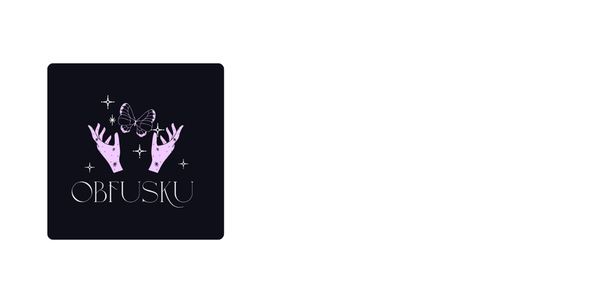

# Obfusku




[](https://github.com/core-red-project/obfusku/actions)

<p align="center">
  <strong>Symbolic Primacy ✦ Strict Hindley-Milner ✦ Tail-Call Optimized</strong><br>
  <em>An esoteric programming language where symbols embody meaning and ritual execution defines semantics.</em>
</p>

<p align="center">
  <a href="#about">About</a> ✦
  <a href="#features">Features</a> ✦
  <a href="#installation">Installation</a> ✦
  <a href="#usage">Usage</a> ✦
  <a href="#architecture">Architecture</a> ✦
  <a href="#contributing">Contributing</a>
</p>

---

## About

**Obfusku** is an esoteric programming language where symbols carry semantic primacy rather than serving as syntactic shortcuts.

Obfusku investigates symbolic purity in programming language design. Rather than layering keywords on top of ASCII syntax, it grounds computation in immutable Core semantics: curried functions, algebraic data types, tail-call optimization, and sound Hindley-Milner type inference.

Source code is tokenized with multi-byte Unicode preservation, parsed into surface AST, desugared into frozen Core AST, verified through strict Hindley-Milner inference, and executed on a lexical environment tree.

### Philosophy

> _"Symbols do not merely represent operations—they embody semantics."_

This is a Core Red Project, part of the Sxnnyside Project ecosystem.

## Features

- **Symbol Primacy & Concrete Grammar**: Computation is expressed through a frozen symbolic alphabet (`λ`, `≔`, `⟡`, `⟢`, `▷`, `☄`, `☊`, `❧`) where glyphs embody semantic primacy rather than acting as ASCII cosmetic sugar.
- **Principal Hindley-Milner Type Inference**: Sound, complete Algorithm W inference engine with parametric polymorphism, polymorphic generalization under value restriction, and explicit monomorphic annotations when desired.
- **First-Class Algebraic Data Types**: Custom sum types with named constructor functions, recursive self-referential types (`List ▷ t`), and parameterized generic variants.
- **Static Pattern Exhaustiveness**: High-assurance pattern matching compiler that statically verifies matrix coverage over constructors, literals, booleans (`◉`/`◎`), and wildcards (`_`), rejecting non-exhaustive branches before runtime.
- **Constant-Stack Tail-Call Optimization (TCO)**: Trampoline-based evaluation runtime eliminating call stack growth on self and mutual tail calls, enabling unbounded recursive computations.
- **Scoped Mutability & Explicit Reference Capture**: Immutable-by-default architecture with explicit mutable cells (`≔˚`), in-place rebind operations (`⚙︎`), and strict lexical closure capture sigils (`˚`).
- **Dynamic-Extent Exception Architecture**: Structured, unwinding error model built around a closed `Exception` ADT, featuring clean `☄` (raise) and `☊` (catch) expression semantics.
- **Ambient Functional Prelude**: Zero-dependency standard library (`stdlib.obk`) providing inductive collections (`List<T>`) and verified higher-order combinators (`map`, `filter`, `fold`) out of the box.
- **Sandboxed Capability I/O**: Host interface providing console streaming (`print`), terminal input (`readLine`), and path-validated filesystem primitives (`readFile`, `writeFile`) scoped securely to entry directory roots.
- **Deterministic Formatter**: Dedicated `obfusku-fmt` engine that canonizes source layout, operator precedence spacing, and semantic indentation with strict roundtrip fidelity.
- **Language Server Protocol (LSP)**: Dedicated `obfusku-lsp` server providing real-time syntax and type diagnostics for editor integrations over JSON-RPC.
- **Multi-Crate Workspace Architecture**: Strict separation of concerns across 8 decoupled workspace crates (`core`, `diagnostics`, `syntax`, `typecheck`, `runtime`, `fmt`, `lsp`, `cli`) forming an acyclic dependency graph.

## Installation

### Quick Install (Linux & macOS)

```bash
curl -fsSL https://raw.githubusercontent.com/core-red-project/obfusku/main/install.sh | bash
```

### Quick Install (Windows PowerShell)

In PowerShell, run:

```powershell
irm https://raw.githubusercontent.com/core-red-project/obfusku/main/install.ps1 | iex
```

### Pre-built Binaries

Download standalone executables directly from [GitHub Releases](https://github.com/core-red-project/obfusku/releases):

- **Linux (x86_64)**: `obfusku-linux-x86_64` & `obfusku-lsp-linux-x86_64`
- **macOS (Apple Silicon / ARM64)**: `obfusku-macos-aarch64` & `obfusku-lsp-macos-aarch64`
- **Windows (x86_64)**: `obfusku-windows-x86_64.exe` & `obfusku-lsp-windows-x86_64.exe`

On Linux/macOS, make the binary executable and move it into your `PATH`:

```bash
chmod +x obfusku-<target>
sudo mv obfusku-<target> /usr/local/bin/obfusku
```

### Via Homebrew (macOS & Linux)

```bash
brew tap sxnnyside-project/tap
brew install obfusku
```

### Via Cargo (crates.io or Git)

Install directly from crates.io:

```bash
cargo install obfusku-cli
cargo install obfusku-lsp
```

Or install the latest commit from source:

```bash
cargo install --git https://github.com/core-red-project/obfusku.git obfusku-cli
cargo install --git https://github.com/core-red-project/obfusku.git obfusku-lsp
```

### Build from Source

```bash
git clone https://github.com/core-red-project/obfusku.git
cd obfusku
cargo build --release -p obfusku-cli
```

This produces a standalone `obfusku` executable at `target/release/obfusku`. Place it on your `PATH` and everything below uses `obfusku` directly, with no further dependency on Cargo, the Rust toolchain, or this repository.

## Usage

Every command below accepts either a single `.obk` file or an Obfusku
Project directory (one containing `obfusku.toml`) — a bare file needs no
manifest at all.

```bash
# Run a program or a Project
obfusku run spell.obk
obfusku run my-project/

# Type-check without running
obfusku check spell.obk

# Format source code
obfusku fmt spell.obk

# Certify a Project as a valid, distributable Source Artifact
obfusku build my-project/

# Interactive REPL
obfusku repl
```

A Project directory needs an `obfusku.toml` naming its entry module:

```toml
format = 1
entry = "main"
```

See `examples/project/` for a complete, runnable Project.

## Architecture

```
obfusku/
├── crates/
│   ├── obfusku-core/         # Core AST & frozen semantic types
│   ├── obfusku-diagnostics/  # Spans, diagnostics, SourceMap
│   ├── obfusku-syntax/       # Lexer, parser, surface AST, desugaring
│   ├── obfusku-typecheck/    # Hindley-Milner type inference & exhaustiveness
│   ├── obfusku-runtime/      # Evaluator, lexical environments, TCO
│   ├── obfusku-fmt/          # Canonical source code formatter
│   ├── obfusku-lsp/          # Language Server Protocol (LSP) daemon
│   └── obfusku-cli/          # CLI interface, stdlib, REPL
├── examples/                 # Executable canonical example suite
└── spec/                     # Formal normative language specifications & ADRs
```

## Contributing

Contributions are accepted. See [CONTRIBUTING.md](CONTRIBUTING.md) for guidelines.

Before contributing, read the [Code of Conduct](CODE_OF_CONDUCT.md).

## License

This project is licensed under the MIT License — see the [LICENSE](LICENSE) file for details.

---

<p align="center">
  <strong>Obfusku</strong> — A Core Red Project<br>
  <em>&copy; 2026 Sxnnyside Project</em>
</p>
